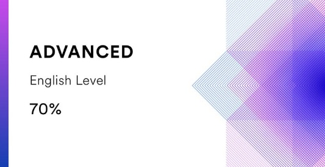

# Iryna Kanavalchuk

## Junior Frontend Developer

### Contact information
>
>**Phone:**  +375 29 188 99 84
>
>**E-mail:**  irkinbk@gmail.com
>
>**Telegram:**  @IrinaKonovalchuk
>
>**Discord:** Irina (@Irina0313)
>
>**[LinkedIn](https://www.linkedin.com/in/irina-konovalchuk)**  

## Skills and Proficiency

- HTML5, CSS3
- JavaScript Basics
- Git, GitHub
- VS Code
- Adobe Photoshop, Figma

## Courses

- Website development with HTML, CSS & JavaScript  at   [IT Academy,](https://www.it-academy.by/course/front-end-developer/)
[*Look at Certificate*]( https://www.it-academy.by/)
- HTML, CSS, and Javascript for Web Developers at [Coursera,](https://www.coursera.org/learn/html-css-javascript-for-web-developers)
[*Look at Certificate*](https://www.coursera.org/account/accomplishments/certificate/8D9VH2LH3AM9)
- JavaScript Manual on  [learn
javascript.ru](https://learn.javascript.ru/)  (in progress)
- RS Schools Course «JavaScript/Front-end. Stage 0» (in progress)

## Code example

**Third Angle of a Triangle**
It is given two interior angles (in degrees) of a triangle.
A function to return the 3rd:

```
function otherAngle(a, b) {
  var c = 180 - (a+b);
  return c;
}
console.log(otherAngle(30, 10));
```

## Languages

- Russian - native
- Belarusian - native
- Ukrainian - intermediate
- English B2 (Intermediate/Upper-intermediate)
    -[Certificate](https://drive.google.com/file/d/1qPYMi3TjAvLzdkYtqcoWv3h36Y9RpyOZ/view?usp=share_link) of English B2 level (Lingoda GmbH)
    -Online test at [EFSET](https://www.efset.org/quick-check)

    
